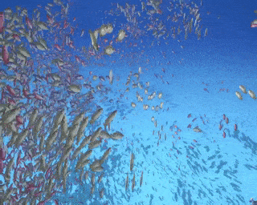

# unity-dots-fish-pack-simulation

4096 fishes moving as packs (a.k.a. Boid) on Unity DOTS.

my rookie work on DOTS.

don't spend effort on this and check this=>
use and learn from this for a proper boid simulation => https://github.com/Unity-Technologies/EntityComponentSystemSamples/tree/master/ECSSamples/Assets/Advanced/Boids
